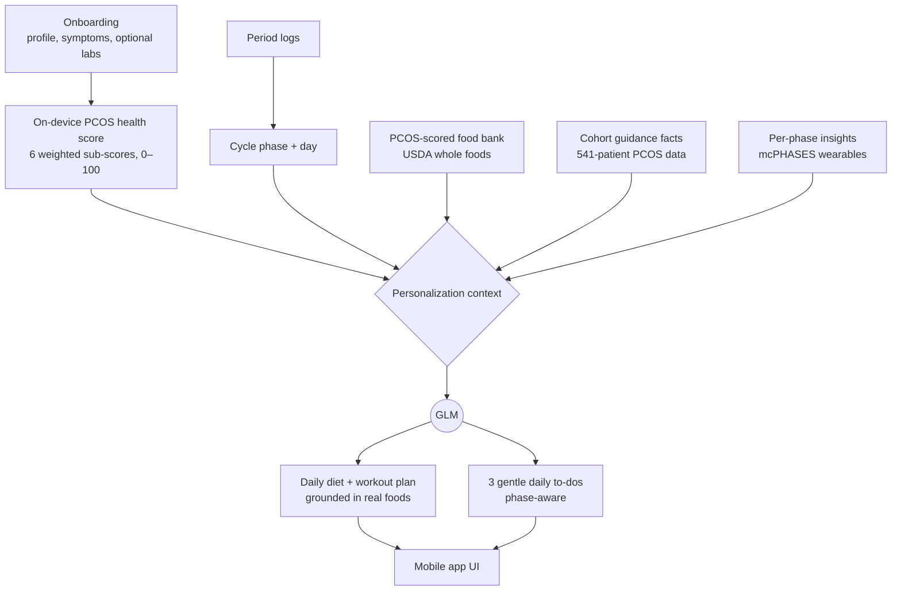

# 🌸 Ovara

**A gentle, cycle-aware wellness companion for women living with PCOS and endometriosis.**

Ovara turns real clinical data and a large language model into a daily plan that actually fits your body — your cycle phase, your symptoms, your diagnosis, and a health score grounded in 541 real patients. Diet, movement, and small kind to-dos, personalized every morning, in a tone that feels like a friend rather than a clinic.

> Built for the **Z.AI GLM** track at Vibe Hack London 2026. Research prototype — **not medical advice**.


🎥 **[Watch the demo](https://youtube.com/shorts/jlANsXPwuM0?feature=share)**

### Why it's different

- **Grounded AI, not improvised advice** — GLM never invents food. It composes meals from a real, pre-scored bank of USDA whole foods, so recommendations stay safe and on-diet.
- **Transparent, validated scoring** — the PCOS health score is built from clinical literature, never trained on the diagnosis label, yet separates PCOS-positive from negative patients with **AUC 0.914**.
- **Privacy-first** — every personal detail stays on your device. No account, no backend, no server, no cloud copy of your health data — we never collect or store it.

---

## Table of contents

- [The problem](#the-problem)
- [What Ovara does](#what-ovara-does)
- [How it works](#how-it-works)
- [The data behind it](#the-data-behind-it)
- [How we use GLM](#how-we-use-glm)
- [Tech stack](#tech-stack)
- [Run it locally](#run-it-locally)
- [Project structure](#project-structure)
- [Development](#development)
- [Safety and limitations](#safety-and-limitations)
- [Roadmap](#roadmap)
- [Credits and data sources](#credits-and-data-sources)

---

## The problem

PCOS (polycystic ovary syndrome) affects roughly **1 in 10** women of reproductive age, and endometriosis a similar number. Both are lifelong, hormone-driven, and deeply individual — yet the advice people are handed is almost always generic: *"eat better, exercise more, manage stress."*

What's missing is something that connects three things that are usually kept apart:

1. **Where you are in your cycle** (symptoms and energy shift dramatically by phase),
2. **What your own body looks like clinically** (a PCOS phenotype is not one-size-fits-all), and
3. **What to actually do today** — a meal, a movement, a small win — instead of a vague guideline.

Ovara is our attempt to close that gap with real data and a thoughtful AI layer.

---

## What Ovara does

Ovara is a mobile app (with a companion web prototype) organized around three tabs and a warm onboarding flow.

| Surface | What you get |
| --- | --- |
| **Onboarding** | A 10-step, conversational intake — name, cycle regularity, diagnosis, symptoms, diet, fitness, body metrics, androgen signs, and *optional* recent lab values. From this it computes your PCOS health score **on the device**. |
| **🌸 Cycle (home)** | A rotatable cycle wheel where one full turn equals one cycle, a scrollable calendar bar, the day's status, and **three gentle, AI-generated to-dos** tuned to your phase and symptoms. |
| **🥗 Diet** | A personalized one-day meal plan — breakfast, lunch, snack, dinner — built by GLM **only** from PCOS-scored real foods, with a short warm note on today's nourishment focus. |
| **🧘🏻‍♀️ Workout** | A cycle-matched movement plan plus tips: gentler restorative work in the menstrual and luteal phases, more energetic training around follicular and ovulatory. |
| **Companion chat** | An empathetic check-in that responds to how you're feeling (cramps, low energy, cravings, mood) with supportive, phase-aware replies. |
| **Period & reflection logging** | Log periods to drive cycle predictions and phase detection; jot a daily reflection and mood. |

Everything is framed gently and explicitly **non-clinical** — Ovara is a companion, not a diagnosis.

---

## How it works

The core idea is **grounded personalization**: we assemble a rich, factual context on the device, then let GLM turn it into something human and actionable. The model is creative *within* guardrails made of real data.



A few principles fall out of this design:

- **The score is computed locally** (`lib/pcosScore.ts`) — a faithful TypeScript port of our Python scoring rubric, tolerant of missing inputs (it renormalizes weights over whatever data you provided).
- **The model is fenced in** — meals must come from the food shortlist we pass it; the prompt forbids inventing processed or high-sugar foods.
- **It degrades gracefully** — no API key, a parse failure, or being offline all fall back to sensible defaults and cached results instead of breaking.

---

## The data behind it

Ovara is **data-backed**, not vibes-backed. Three real datasets were cleaned, transparently scored, validated, and then distilled into compact TypeScript modules that ship inside the app — no heavy data files at runtime.

| Dataset | What it is | Size | Role in Ovara |
| --- | --- | --- | --- |
| **Kaggle PCOS cohort** | Real anonymized clinical patients, 33 fields each | **541 patients** | The validated anchor for the PCOS health score |
| **USDA FoodData Central** | Whole-food nutrients per 100 g (Foundation, SR-Legacy, Survey/FNDDS) | **13,694 foods** | PCOS diet-quality scoring + grounding for meal plans |
| **PhysioNet mcPHASES** | Longitudinal self-report + wearable signals | **42 participants** | Per-phase and per-cycle-day insights (cramps, resting HR, HRV) |

### A health score you can audit

The PCOS health score (0–100, where **100 = healthiest**) is a weighted blend of six sub-scores, each mapped from clinical thresholds — Rotterdam criteria, ACC/AHA blood-pressure stages, WHO waist-to-hip cutoffs, ADA glucose bands, Endocrine Society vitamin-D ranges:

| Sub-score | Weight | Based on |
| --- | --- | --- |
| Hyperandrogenism | 0.20 | Rotterdam pillar 1 (hirsutism, acne, alopecia) |
| Cycle / ovulatory | 0.20 | Rotterdam pillar 2 (cycle regularity) |
| Imaging / PCOM | 0.20 | Rotterdam pillar 3 (follicle burden) |
| Metabolic | 0.20 | BMI, waist:hip, glucose, blood pressure |
| Hormonal | 0.12 | AMH, LH:FSH, TSH, prolactin, vitamin D |
| Lifestyle | 0.08 | Diet and exercise (the modifiable levers) |

### Why we trust it

The score is **never fit to the diagnosis label** — it's built purely from the clinical literature. We then test how well it separates patients who *were* diagnosed:

| Metric | Result |
| --- | --- |
| **AUC** (does the score separate PCOS+ from PCOS−?) | **0.914** |
| Mean score, PCOS-positive | **59.3** |
| Mean score, PCOS-negative | **82.2** |

In other words: clinical knowledge alone, with no training on the outcome, ranks patients correctly. The food score is similarly face-valid — almonds, flaxseed, and soybeans rank highest; sprinkles, flavored creamer, and frosted cookies rank lowest.

> The whole pipeline is reproducible. Python build scripts in `ovara-mobile/data/provenance/` regenerate the scored CSVs and validation reports, and `ovara-mobile/scripts/` distill them into the app's TypeScript data modules.

---

## How we use GLM

GLM is the layer that turns cold context into something warm and specific. We use it in **two distinct, grounded calls**, plus an offline companion. Every model call goes through a shared AI layer (`lib/aiChat.ts`) with **GLM as the primary provider and Claude as an automatic fallback** — if a GLM call errors, hits quota, or returns nothing, the same request is retried against Claude transparently.

**1 — Personalized diet & workout plan** (`lib/llm.ts`, model **GLM-5.1** via the Z.AI Coding API)
The prompt carries the user's profile, PCOS health score and *weakest* sub-scores, cycle phase, evidence facts distilled from the 541-patient cohort, and a role-balanced shortlist of PCOS-scored foods filtered to their diet. GLM returns strict JSON — four meals, a workout, and three tips — which we normalize, validate, and render. Crucially, **every meal must be built from the real foods we supplied**, which keeps the model from hallucinating unhealthy or off-diet suggestions.

**2 — Gentle daily to-dos** (`lib/glm.ts`, **GLM-5.1** via the shared AI layer)
A lighter call that returns exactly three small, kind, phase-aware tasks (each ≤ 8 words) as compact JSON, tuned to the cycle day and any symptoms. It runs through the same shared AI layer (GLM primary, Claude fallback) as the plan generator.

**3 — Companion chat** (`lib/ai.ts`)
An empathetic, rule-based responder that works fully offline — the safety net so the app stays supportive even with no connectivity or key.

### Configuration

**One GLM key drives the whole app** (plans + daily to-dos); add a Claude key for automatic failover. Copy `ovara-mobile/.env.example` to `.env` and fill it in (the file is gitignored). Either provider alone works; set both for resilience.

| Variable | Used by | Default |
| --- | --- | --- |
| `EXPO_PUBLIC_GLM_API_KEY` | Primary — plans + daily to-dos | — (**required** unless using Claude) |
| `EXPO_PUBLIC_GLM_BASE_URL` | GLM | `https://api.z.ai/api/coding/paas/v4` |
| `EXPO_PUBLIC_GLM_MODEL` | GLM | `GLM-5.1` |
| `EXPO_PUBLIC_CLAUDE_API_KEY` | Fallback — used if GLM fails | — (optional) |
| `EXPO_PUBLIC_CLAUDE_BASE_URL` | Claude | `https://api.anthropic.com` |
| `EXPO_PUBLIC_CLAUDE_MODEL` | Claude | `claude-opus-4-8` (use `claude-haiku-4-5` for cheaper/faster) |

> Documented GLM coding models (UPPERCASE): `GLM-5.1`, `GLM-5V-Turbo`, `GLM-4.7`, `GLM-4.5-AIR`. `GLM-5.1` is premium — peak hours (14:00–18:00 UTC+8) draw quota at a higher rate; switch to `GLM-4.7` if you hit limits, or rely on the Claude fallback.

---

## Tech stack

| Layer | Choices |
| --- | --- |
| **Mobile app** | Expo SDK 54, React Native 0.81, React 19, Expo Router 6 (file-based, typed routes), TypeScript 5.9 |
| **Motion & gestures** | `react-native-reanimated` 4 + `react-native-gesture-handler` — the rotatable cycle wheel, swipeable cards, scrollable calendar |
| **Storage** | `expo-secure-store` (native) / `localStorage` (web) — on-device only, no backend |
| **Look & feel** | `expo-linear-gradient`, Google Fonts (Fraunces + Nunito), `@expo/vector-icons` |
| **AI** | GLM-5.1 via Z.AI Coding API (primary) with Claude (Anthropic Messages API) automatic fallback — shared layer `lib/aiChat.ts` |
| **Data / ML** | Python + pandas — clinical and nutrition scoring rubrics, validation (AUC), distillation to TypeScript |
| **Web prototype** | TanStack Start + Router, Vite, Tailwind, shadcn/Radix UI, Vercel AI SDK (built with Lovable) |

---

## Run it locally

**Prerequisites:** Node 18+, a GLM / Z.AI API key, and the [Expo Go](https://expo.dev/go) app or an iOS/Android simulator.

### The mobile app (the main product)

```bash
cd ovara-mobile
npm install

cp .env.example .env       # then paste your GLM / Z.AI key
npx expo start             # scan the QR code with Expo Go
```

You can set up and run it in well under 10 minutes. Without a key the app still runs — you'll see the gentle defaults instead of AI-generated plans.

### The web prototype (optional)

```bash
cd ovara-bloom-and-thrive
bun install                # or: npm install
bun dev                    # or: npm run dev
```

### Regenerate the data (optional)

```bash
cd ovara-mobile
python3 data/provenance/build_anchor.py   # PCOS cohort -> pcos_scored.csv + validation
python3 data/provenance/build_food.py     # USDA foods  -> food_scored.csv + validation
python3 scripts/build_food_bank.py        # distill CSVs -> lib/foodBank.ts, etc.
```

---

## Project structure

```text
.
├── ovara-mobile/                 # ⭐ the main Expo / React Native app
│   ├── app/                      # screens (Expo Router): tabs, onboarding, chat, logging
│   ├── components/               # CycleWheel, CalendarBar, SwipeableCard, ...
│   ├── lib/
│   │   ├── aiChat.ts             # shared AI transport — GLM primary, Claude fallback
│   │   ├── llm.ts                # diet + workout plan generator (grounded)
│   │   ├── glm.ts                # daily to-do generator
│   │   ├── ai.ts                 # offline companion chat
│   │   ├── pcosScore.ts          # on-device PCOS health score (rubric port)
│   │   ├── selectFoods.ts        # picks the food shortlist GLM is allowed to use
│   │   ├── foodBank.ts           # distilled PCOS-scored foods  (auto-generated)
│   │   ├── pcosGuidance.ts       # cohort guidance facts        (auto-generated)
│   │   └── phaseInsights.ts      # per-phase mcPHASES insights   (auto-generated)
│   ├── data/                     # vendored datasets, scoring rubric, validation, provenance
│   └── scripts/                  # Python distillers (CSV -> TypeScript)
│
└── ovara-bloom-and-thrive/       # companion web prototype (TanStack + Lovable)
```

---

## Development

Day-to-day commands for working on the mobile app (the user-facing quickstart is in [Run it locally](#run-it-locally)).

```bash
cd ovara-mobile
npm install                      # install dependencies
cp .env.example .env             # then add your EXPO_PUBLIC_GLM_API_KEY

npx expo start                   # run on Expo Go / a simulator
npx tsc --noEmit                 # type-check the whole app
node scripts/smoke_glm.mjs       # verify your key + endpoint return a valid plan
```

Regenerate the bundled data modules after changing a dataset or scoring rubric:

```bash
python3 data/provenance/build_anchor.py   # -> data/pcos_scored.csv + validation
python3 data/provenance/build_food.py     # -> data/food_scored.csv + validation
python3 scripts/build_food_bank.py        # -> lib/foodBank.ts
python3 scripts/build_pcos_guidance.py    # -> lib/pcosGuidance.ts
python3 scripts/build_phase_insights.py   # -> lib/phaseInsights.ts
python3 scripts/build_cycle_day_data.py   # -> lib/cycleDayData.ts
```

- Requires **Node 18+**; the data scripts need **Python 3** with `pandas` (and `openpyxl` for the anchor).
- Generated `lib/*.ts` data modules are committed — only re-run the scripts when source data changes.
- Branch workflow: feature branches (e.g. `ali/feat/data`) → PR → `main`.

---

## Safety and limitations

- **Not a medical device.** Ovara is a research and hackathon prototype. It does not diagnose, treat, or replace professional care, and it says so throughout the experience.
- **The cohort is specific.** The health score reflects one 541-subject fertility-clinic cohort; thresholds (especially AMH) are population- and assay-sensitive.
- **The food score is a heuristic.** It's a transparent nutrient-based quality index, not a clinically validated diet score, and it omits signals like glycemic index and micronutrients (inositol, magnesium).
- **The datasets don't join.** The clinical, nutrition, and wearable layers come from different populations and are used as independent reference layers — never as patient-linked records.

---

<p align="center"><em>Made with care for people whose bodies deserve software that listens. 🌸</em></p>
